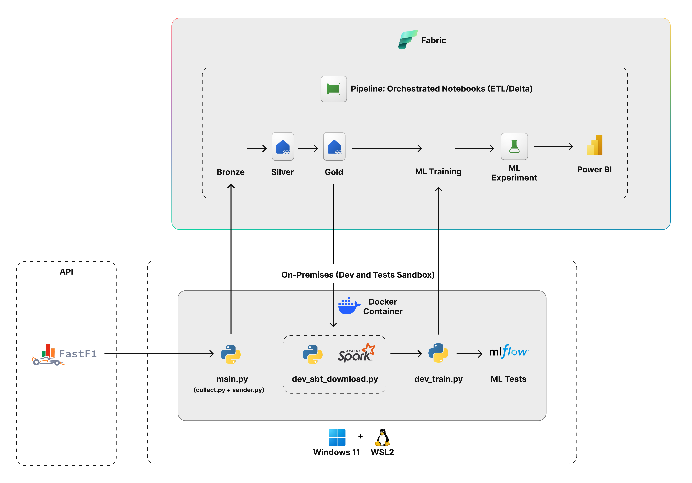

# 🏎️ F1 Lake & Machine Learning Pipeline

Projeto de Engenharia de Dados e Machine Learning voltado para a extração, processamento, transformação e análise preditiva de dados históricos e de telemetria da Fórmula 1.

A arquitetura adota uma abordagem híbrida, combinando um ambiente **On-Premises / Local Sandbox (Docker + WSL2)** para prototipação, engenharia de recursos (Feature Store/ABT) e validação de modelos com **MLflow**, integrado ao ecossistema **Microsoft Fabric** para orquestração escalável em nuvem, armazenamento Medallion (Bronze/Silver/Gold) e visualizações no **Power BI**.

---

## 💰 Estratégia FinOps e Otimização de Recursos

Para garantir eficiência operacional e evitar custos desnecessários de computação em nuvem (*Capacity Units* / instâncias Spark no Microsoft Fabric), o projeto adota uma estratégia orientada a **FinOps**:

* **Processamento Pesado em Nuvem:** O Microsoft Fabric é utilizado exclusivamente para ingestão, transformações da arquitetura Medallion (Bronze -> Silver -> Gold) e orquestração de pipelines.
* **Prototipagem e ML Local:** Toda a etapa de download da **ABT (Analytical Base Table)**, engenharia de atributos avançada, testes iterativos de Machine Learning e *hyperparameter tuning* é realizada **localmente na Sandbox (Docker/WSL2)**. 
* **Economia Dinâmica:** Essa abordagem reduz drasticamente o consumo de unidades de computação pagas na nuvem durante a fase de desenvolvimento e experimentação dos modelos.

---

## 📐 Arquitetura da Solução



A arquitetura do projeto é estruturada em dois grandes ecossistemas:

### 1. On-Premises / Dev Sandbox (Windows 11 + WSL2 + Docker)
* **Ingestão (`main.py` / `collect.py` + `sender.py`):** Consome dados de telemetria e corridas via biblioteca/API **FastF1** e faz a ingestão inicial direcionada à camada Bronze no Lakehouse.
* **Processamento Local & FinOps (`dev_abt_download.py` com Apache Spark):** Baixa a **ABT** pré-calculada na camada Gold para a máquina local. Isso permite treinar e iterar modelos de ML localmente sem gerar custos de computação (*compute capacity*) na nuvem.
* **Treinamento e Experimentos (`dev_train.py` + MLflow):** Executa os scripts de Machine Learning e registra métricas, parâmetros e artefatos de modelo em um servidor local do **MLflow** (`mlflow.db` e `mlartifacts/`).

### 2. Microsoft Fabric (Nuvem)
* **Arquitetura Medallion (Delta Lake):**
  * **Bronze:** Armazenamento dos dados brutos recebidos da extração via FastF1.
  * **Silver (`lh_f1_lake_silver`):** Limpeza, padronização e estruturação dos dados de resultados e corridas (`f1_results`).
  * **Gold (`lh_f1_lake_gold`):** Camada analítica refinada e Feature Store (`fs_f1_driver_life`), contendo estatísticas acumuladas dos pilotos por data de referência.
* **Pipeline & Orquestração:** Pipelines do Fabric para orquestrar a execução sequencial dos Notebooks ETL/Delta.
* **ML Training & Experiment:** Registro e execução de modelos consolidados em ambiente corporativo.
* **Power BI:** Dashboards e relatórios conectados diretamente à camada Gold do Fabric.

---

## 📁 Estrutura do Repositório

```text
f1-lake/
├── .vscode/                 # Configurações de ambiente do VS Code
├── data/                    # Dados locais e ABTs geradas (ex: abt_f1_drivers_champion.csv)
├── docs/                    # Documentação do projeto
│   └── architecture.png     # Diagrama de arquitetura da solução
├── fabric/                  # Notebooks e pipelines mantidos no MS Fabric
├── mlartifacts/             # Artefatos e modelos salvos pelo MLflow
├── src/                     # Módulos Python e scripts auxiliares
├── .env                     # Variáveis de ambiente e credenciais
├── .gitignore               # Arquivos/pastas ignorados pelo Git
├── docker-compose.yml       # Configuração dos serviços da Sandbox local
├── Dockerfile               # Definição da imagem Docker do projeto
├── LICENSE                  # Licença do repositório
├── main.py                  # Script principal de orquestração local (coleta e envio)
├── mlflow.db                # Banco SQLite para persistência do MLflow
├── README.md                # Documentação principal do projeto
└── requirements.txt         # Pacotes e dependências Python